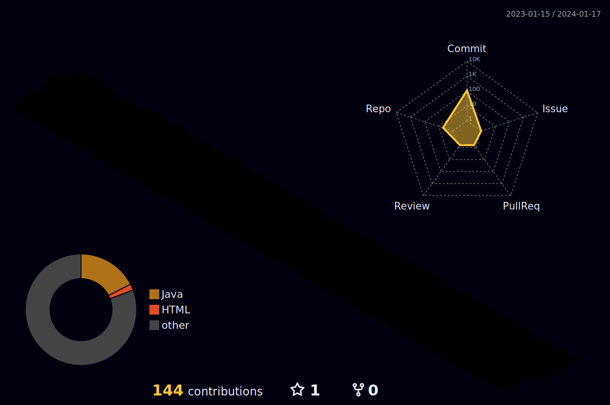

<h1 align="center"> Welcome to my profile </h1>

  

### ⚡ About me:

- 👨🏻‍💻 I’m **Juanjo Salguero**

- 🌍 I live in **Marbella, Spain**

- 🎓 I’m currently studying **DAM**

- 🌱 I’m currently learning **Java**

- 📫 How to reach me **juanjosalguero96@hotmail.com**

 

### 🌐 Conect with me:

 

### 🔧 Languages and Tools

          

 

### 3D Contribution Graph:

 

### 📊 Github Stats

