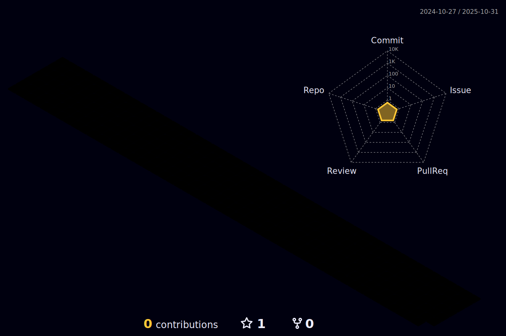

<h1 align="center"> Welcome to my profile </h1>
<h3 align="center">💻 Software developer from Spain.</h3>

  

- 👦 I’m **Juanjo Salguero**

- 🌍 I live in **Marbella, Spain**

- 🎓 I’m currently studying **DAM**

- 🌱 I’m currently learning **Java**

- 📫 How to reach me **juanjosalguero96@hotmail.com**

<h3 align="left">Connect with me:</h3>

<h3 align="left">Languages and Tools:</h3>

          

<h3 align="left">3D Contribution Graph:</h3>

<h3 align="left">GitHub Status:</h3>

&nbsp;

